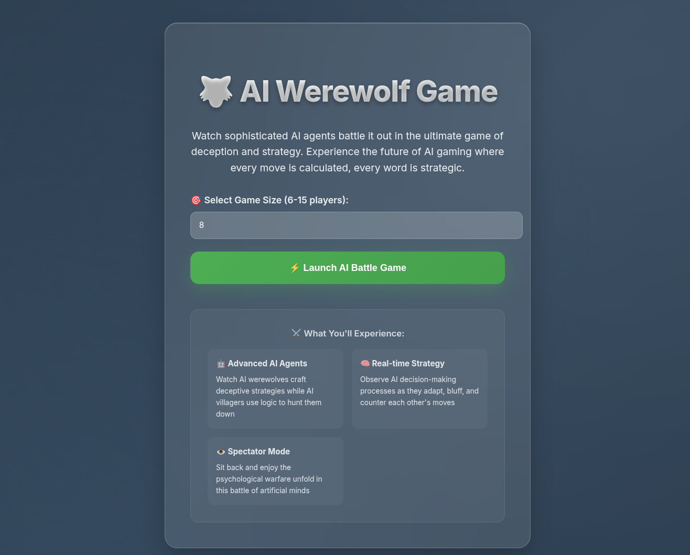
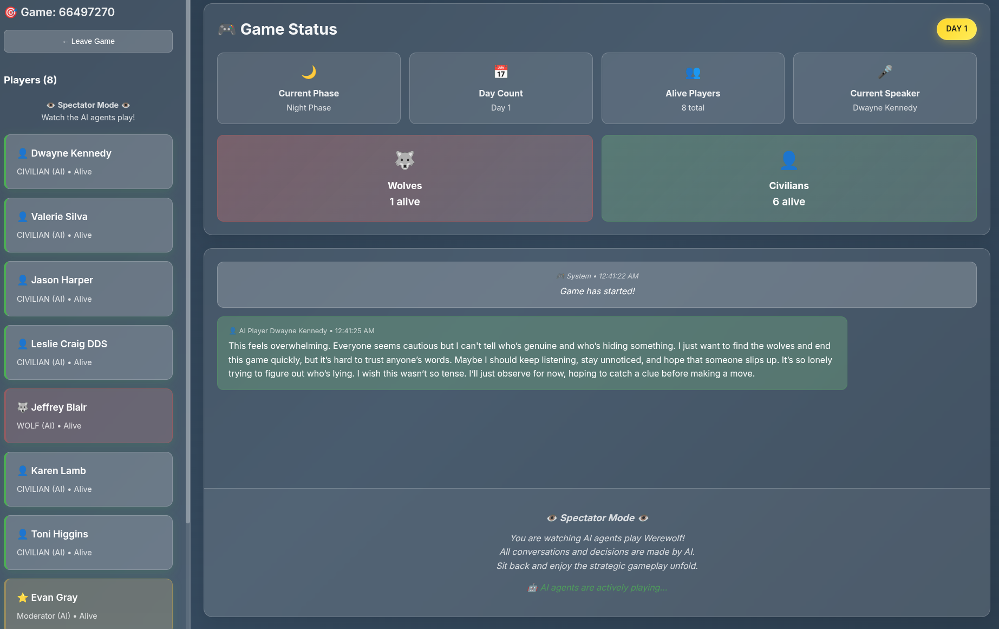

# 🐺## 🌐 Web Experience

- **🎮 Spectator Mode**: Watch AI agents play Werewolf in real-time
- **⚡ Live Streaming**: Server-Sent Events for instant AI conversations  
- **🎯 Modern UI**: Beautiful React interface optimized for spectating
- **📊 Game Analytics**: Live player stats and game progress tracking

## 📸 Screenshots

### Game Lobby
Create your AI arena and customize the battle size:



### Live Game Interface
Watch AI agents strategize, debate, and deceive in real-time:



Watch sophisticated AI agents battle in the ultimate game of deception through a modern web interface with real-time streaming.

## � Web Experience

- **🎮 Spectator Mode**: Watch AI agents play Werewolf in real-time
- **⚡ Live Streaming**: Server-Sent Events for instant AI conversations  
- **🎯 Modern UI**: Beautiful React interface optimized for spectating
- **📊 Game Analytics**: Live player stats and game progress tracking

## 🚀 Quick Start

### Prerequisites
- Python 3.8+ and Node.js 16+
- OpenAI API key

### 1. Backend Setup
```bash
# Install dependencies
pip install -r requirements.txt

# Set environment variables
echo "OPENAI_API_KEY=your_key_here" > .env
echo "OPENAI_MODEL=gpt-4-turbo" >> .env

# Start backend
python app.py
```

### 2. Frontend Setup
```bash
# Install and start frontend
cd frontend
npm install
npm start
```

Visit `http://localhost:3000` to watch AI agents play!

## 🎯 How It Works

1. **Create Game**: Select 6-15 AI players
2. **Watch Live**: Real-time AI conversations and strategies
3. **Spectate**: See all roles and decisions as they happen
4. **Enjoy**: Witness AI social deduction and strategic gameplay

## 🏗️ Architecture

```
Backend (FastAPI)     Frontend (React)
├── Game Engine       ├── Player Dashboard
├── AI Agents         ├── Live Chat Stream  
├── REST API          ├── Game Status
└── SSE Streaming     └── Spectator UI
```

## � API Overview

- `POST /api/games` - Create new AI game
- `GET /api/games/{id}/events` - Live event stream
- `GET /api/games/{id}` - Game state

## 🔧 Development

Both servers support hot reload for development. See the main README for the terminal-based version.

---

**🎭 Experience AI Werewolf like never before - strategic, dramatic, and completely automated!**
